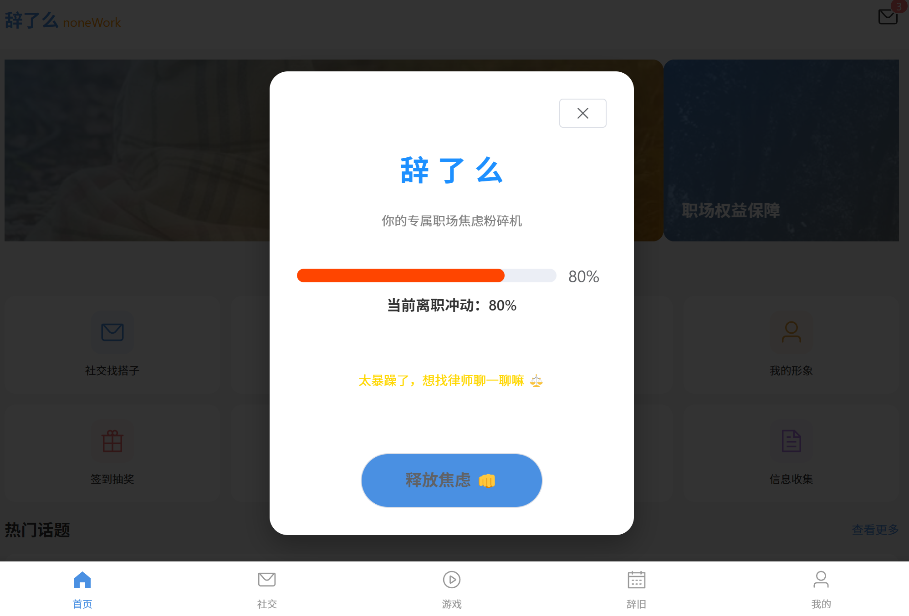
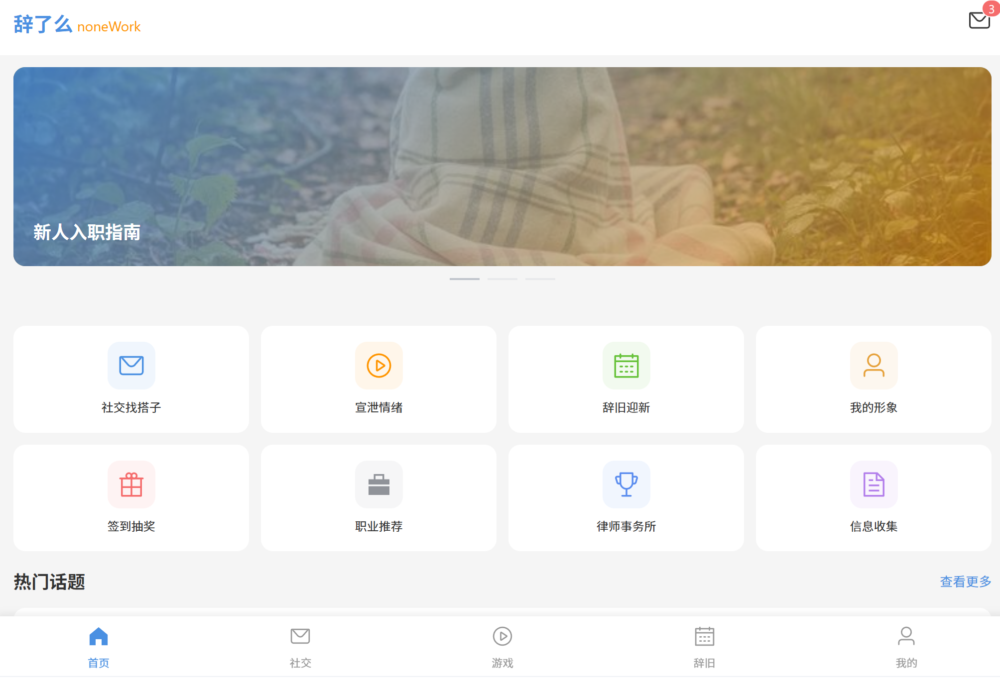

# 辞了么 noneWork

一个让职场情绪“负负得正”的疗愈小程序，你的情绪，值得先被“看见”，再被“解决”，一个专为职场人打造的焦虑释放与离职权益服务。

活动：20260418数栖湾clab黑客松

## 截图

### 互动功能


### 首页



### 功能页面



<br />

## 技术栈

- **前端框架**: Vue 3 (Script Setup)
- **构建工具**: Vite 8.0.4
- **UI 组件库**: Element Plus 2.13.7
- **图标库**: @element-plus/icons-vue 2.3.2
- **路由管理**: Vue Router 4.6.4
- **HTTP 客户端**: Axios 1.15.0
- **模拟数据**: MockJS 1.1.0

## 功能模块

### 首页 (Home)

- 应用入口，展示核心功能入口
- Banner 轮播图
- 热门话题推荐
- 焦虑释放进度条互动功能

### 社交找搭子 (Social)

- 搭子列表与匹配
- 私聊功能
- 虚拟形象装扮

### 游戏中心 (Game)

- 情绪宣泄游戏
- 签到抽奖活动

### 辞旧迎新 (Farewell)

- N+1 赔偿争取建议
- 职业推荐服务
- 律师事务所对接

### 个人中心 (Profile)

- 用户信息管理
- 形象装扮
- 我的奖品

## 快速开始

### 安装依赖

```bash
npm install
```

### 开发模式

```bash
npm run dev
```

访问 <http://localhost:5173>

### 构建生产版本

```bash
npm run build
```

构建产物输出至 `dist` 目录

### 预览生产构建

```bash
npm run preview
```

## 项目结构

```
cilent/
├── public/              # 静态资源
├── src/
│   ├── api/             # API 请求封装
│   ├── assets/          # 资源文件
│   ├── components/      # 公共组件
│   ├── mock/            # 模拟数据
│   ├── router/          # 路由配置
│   ├── styles/          # 全局样式
│   ├── views/           # 页面组件
│   ├── App.vue          # 根组件
│   └── main.js          # 入口文件
├── dist/                # 构建产物
├── package/             # Docker 部署包
├── Dockerfile           # Docker 配置
├── docker-compose.yml   # Docker Compose 配置
├── index.html           # HTML 入口
├── package.json         # 项目配置
└── vite.config.js       # Vite 配置
```

## 路由列表

| 路径                 | 页面           | 描述       |
| ------------------ | ------------ | -------- |
| `/home`            | Home         | 首页       |
| `/social`          | Social       | 社交找搭子    |
| `/social/chat/:id` | Chat         | 聊天       |
| `/social/virtual`  | Virtual      | 虚拟形象     |
| `/game`            | Game         | 游戏中心     |
| `/game/emotion`    | Emotion      | 宣泄情绪     |
| `/game/lottery`    | Lottery      | 签到抽奖     |
| `/farewell`        | Farewell     | 辞旧迎新     |
| `/farewell/n1`     | N1Advice     | N+1 争取建议 |
| `/farewell/job`    | JobRecommend | 职业推荐     |
| `/farewell/lawyer` | Lawyer       | 律师事务所    |
| `/profile`         | Profile      | 个人中心     |
| `/profile/avatar`  | Avatar       | 形象装扮     |
| `/profile/prizes`  | Prizes       | 我的奖品     |

## API 代理

开发环境下，API 请求通过 Vite 代理转发至 `http://localhost:3000`

```javascript
proxy: {
  '/api': {
    target: 'http://localhost:3000',
    changeOrigin: true
  }
}
```

## Docker 部署

### 构建镜像

```bash
docker build -t cilent:latest .
```

### 启动服务

```bash
docker-compose up -d
```

访问 <http://localhost>

## 环境要求

- Node.js >= 18
- npm >= 9

